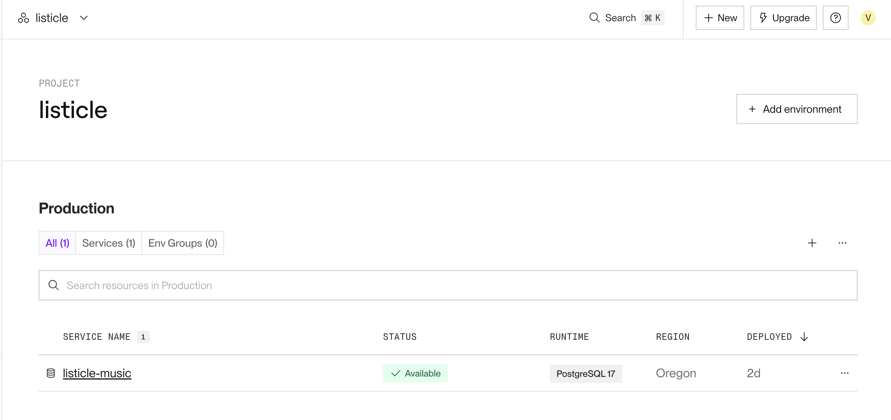
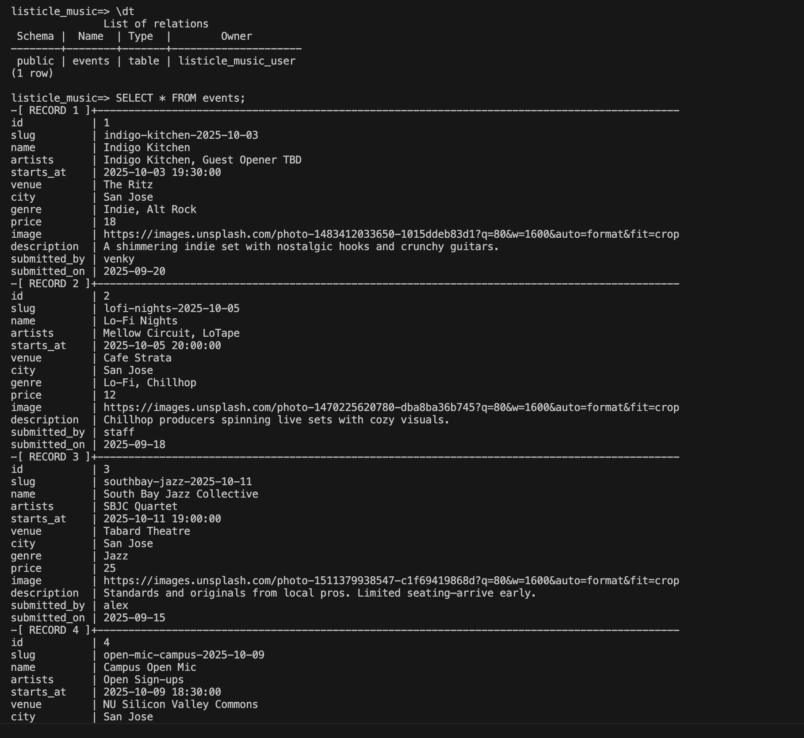

# WEB103 Project 2 - SoundScout 🎶

Submitted by: **Venkatesh Kelam**

About this web app: **SoundScout helps users discover local live music events. It connects to a PostgreSQL database to fetch event details such as name, artists, date/time, venue, genre, and ticket price. The app allows users to browse through events, view details on each event, and filter by category or search by attributes.**

Time spent: **5** hours

## Required Features

The following **required** functionality is completed:

- [x] **The web app uses only HTML, CSS, and JavaScript without a frontend framework**
- [x] **The web app is connected to a PostgreSQL database, with an appropriately structured database table for the list items**
  - [x] **Walkthrough includes a screenshot of the Render dashboard showing that the Postgres database is available**
  - [x] **Walkthrough includes a demonstration of the table contents using `psql` and `SELECT * FROM events;`**

  ## Database Verification

**Render Dashboard Screenshot**

**psql Table Screenshot**

The following **optional** features are implemented:

- [x] The user can filter events by genre with a dropdown menu

The following **additional** features are implemented:

- [x] Responsive grid layout (3 cards per row on desktop, 2 on medium, 1 on mobile)
- [x] Detail view for each event with styled image, description, and metadata
- [x] Dark theme styling with Pico.css and custom CSS
- [x] 404 page with SVG and a link back to home
- [x] JSON API endpoints (`/api/events`, `/api/events/:slug`) for future integrations

## Video Walkthrough

Here's a walkthrough of implemented required features:

## Notes

Some challenges I encountered:
- Getting PostgreSQL connected correctly on Render (SSL issues required `PGSSLMODE=require` in `.env`).
- Ensuring CSS grid always displayed exactly 3 cards per row on desktop without breaking mobile responsiveness.
- Fixing the hero background issue: Express was serving `404.svg` for missing images, so I had to adjust both the CSS and the Express 404 middleware.
- Debugging template placeholders so that detail pages correctly displayed event images and metadata.

## License

Copyright 2025 **Venkatesh Kelam**

Licensed under the Apache License, Version 2.0 (the "License"); you may not use this file except in compliance with the License.  
You may obtain a copy of the License at:

> http://www.apache.org/licenses/LICENSE-2.0

Unless required by applicable law or agreed to in writing, software distributed under the License is distributed on an "AS IS" BASIS,  
WITHOUT WARRANTIES OR CONDITIONS OF ANY KIND, either express or implied. See the License for the specific language governing permissions and limitations under the License.
